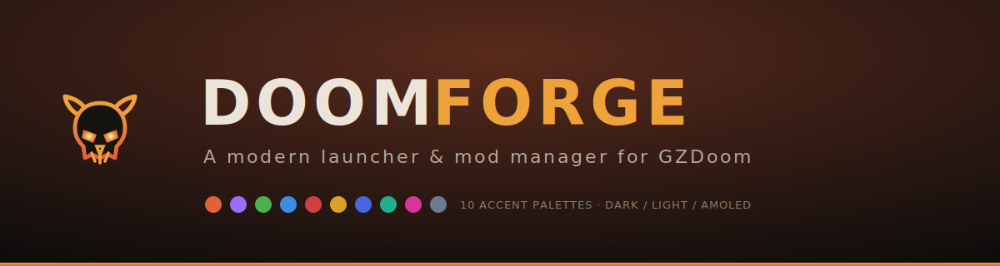
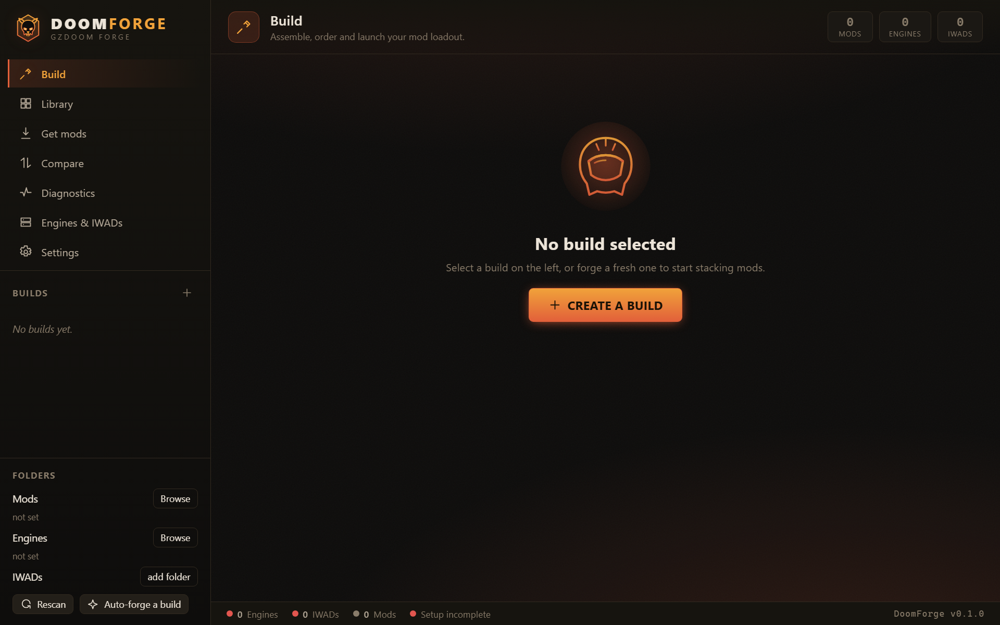
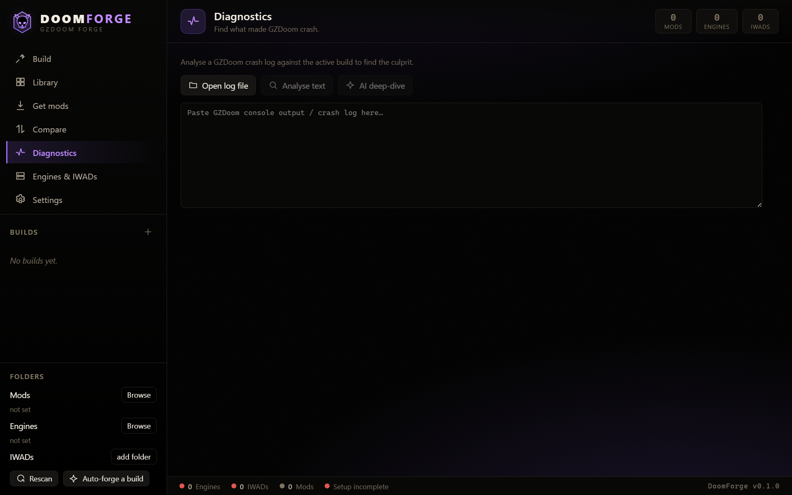
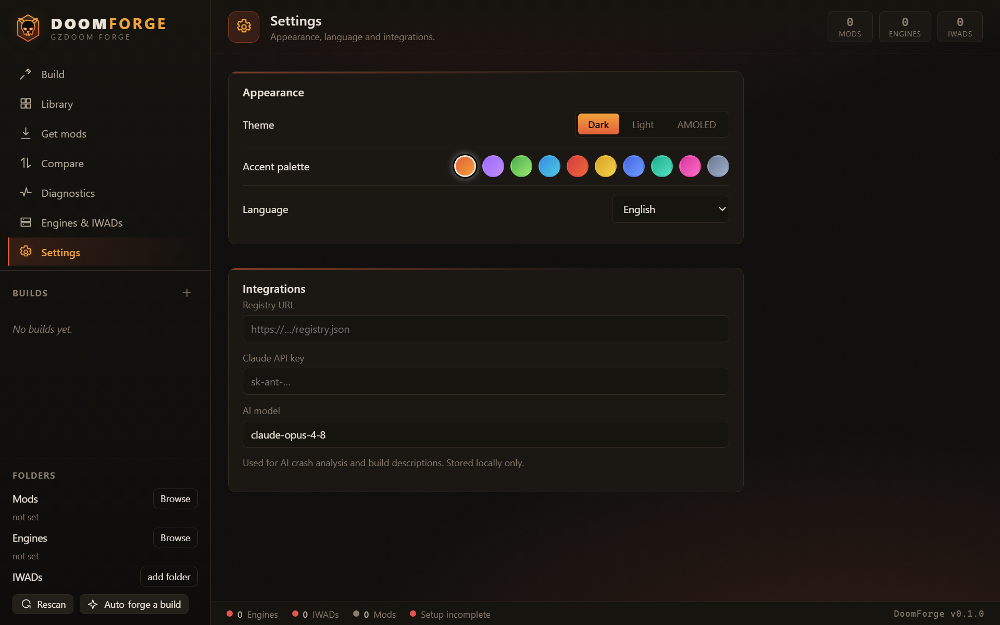
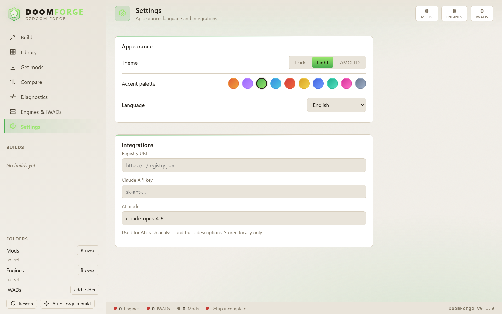
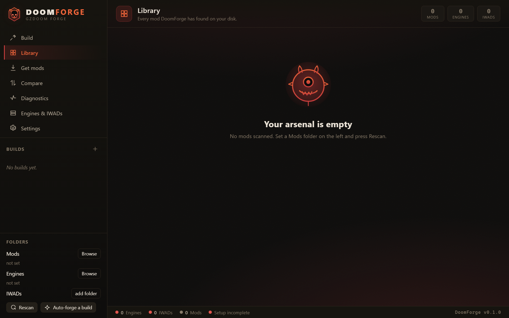

<p align="center">
  
</p>

<p align="center">
  <a href="https://github.com/villetacore/doom-forge/actions/workflows/ci.yml"></a>
  
  
  
  
  
</p>

<p align="center">
  <b>DoomForge</b> is a modern launcher and mod manager for <b>GZDoom</b> (and LZDoom / Zandronum / VKDoom).<br/>
  Build mod loadouts, resolve conflicts, launch, and diagnose crashes — all from one fast desktop app.<br/>
  <i>Think “Steam + Vortex + Cargo, but for GZDoom”.</i>
</p>

---

## Screenshots

|  |  |
| :--: | :--: |
| **Build a loadout** | **Diagnostics** |
|  |  |
| **Settings — themes & palettes** | **Light theme** |
|  |  |

<p align="center"></p>

## Features

### Build & launch
- **Mod scanning** of a folder tree (`.pk3 .pk7 .wad .zip .pke .ipk3 .deh .bex`) with automatic
  grouping into Maps / Gameplay / Audio / Visuals / Patches.
- **Build profiles** — create / edit / delete, persisted as JSON, plus **export / import** as a
  single `.dfprofile` file.
- **Drag-and-drop load order** with per-entry enable/disable and an **auto-sort** heuristic
  (maps & gameplay first, visual/audio/patch overrides last).
- **Launch**, **Safe mode** (`-noautoload`) and **Autotest** (dry-run validation).

### Curate & understand
- **Conflicts DB → compatibility score (%)**, a **dependency graph**, and **build comparison**.
- **Snapshots / history / rollback**, a **stability rating**, and Markdown **problem reports**.
- **Duplicate detection** (identical SHA-256 or same filename) and **content search** inside archives.
- **Crash-log analysis** — local culprit detection plus an optional **Claude AI** deep-dive.
- **Recommendations** and one-click **“forge a 2026 build”** auto-assembler.

### Get the goods
- **Engine & IWAD setup** — download the free **Freedoom** IWADs and the latest **GZDoom**, or
  **detect** engines already on your `PATH`.
- **Mod downloads** — a curated catalog, **Import by URL**, and a pluggable custom registry.

### Power tools
- A **`doom` CLI** package manager (`doom add … && doom run`).

## Themes & color schemes

DoomForge ships **3 base modes** — **Dark**, **Light**, and **AMOLED** (true black) — combined with
**10 accent palettes**:

`Ember` · `Plasma` · `Toxic` · `Abyss` · `Blood` · `Gold` · `Cobalt` · `Viridian` · `Magenta` · `Slate`

Pick any mode + palette combination in **Settings → Appearance**; your choice is saved locally.

## Languages

The UI is fully translated into **11 languages**, switchable in **Settings → Language**:

| | | | |
|---|---|---|---|
| English | Русский | Українська | Deutsch |
| Français | Español | Italiano | Português |
| Polski | 中文 | 日本語 | |

> Adding a language is one file in [`src/i18n/`](src/i18n/) plus an entry in `LANGUAGES`. A test
> enforces that every dictionary defines exactly the same keys as English.

## Install & build

**Prerequisites:** [Node.js](https://nodejs.org) 18+, the [Rust](https://rustup.rs) toolchain, and the
Tauri 2 system dependencies (on Windows the **WebView2** runtime — preinstalled on Win10/11 — and the
**Visual Studio C++ build tools**).

```bash
# install frontend dependencies
npm install

# run in development (Vite + the Rust app)
npm run app:dev

# build a production installer for your OS
npm run app:build
```

<details>
<summary>Windows one-liners</summary>

```powershell
# one-time: install Rust if missing
winget install --id Rustlang.Rustup -e

powershell -ExecutionPolicy Bypass -File scripts\win-build.ps1   # build
powershell -ExecutionPolicy Bypass -File scripts\win-run.ps1     # run dev
```
</details>

<details>
<summary>Build / run via WSL</summary>

See `scripts/wsl-*.sh` — they mirror the project into the Linux filesystem and build there
(building on `/mnt/c` is slow and corrupts native npm packages).
</details>

## Development

```bash
npm run build        # type-check (tsc) + production frontend build
npm test             # frontend unit tests (Vitest)

cd src-tauri
cargo test           # Rust domain tests
cargo clippy         # lints
```

Frontend tests cover i18n key parity across all 11 languages and the theme engine; Rust tests cover
the load-order heuristic, launch-argument builder, conflict scoring, mod classification, and the
profile export/import roundtrip.

## CI/CD

- **[CI](.github/workflows/ci.yml)** runs on every push and PR: frontend build + Vitest, and
  `cargo clippy` + `cargo test` on Linux and Windows.
- **[Release](.github/workflows/release.yml)** runs on a version tag (`v*`) and builds signed-ready
  installers for **Windows, macOS (Intel + Apple Silicon) and Linux** via
  [`tauri-action`](https://github.com/tauri-apps/tauri-action), publishing a draft GitHub Release.

```bash
git tag v0.1.0 && git push origin v0.1.0   # triggers the release build
```

## Architecture

```
src/                     React + TypeScript frontend
  components/            Icon set, Doom-inspired SVG art, EmptyHero
  features/<area>/       shell · build · library · browse · compare · crash · status · settings
  i18n/                  11 language dictionaries + useT() hook
  theme/                 modes + accent palettes (CSS variables)
  store/                 zustand state (+ localStorage settings)
  lib/                   typed Tauri command wrappers + shared types
src-tauri/src/           Rust backend
  domain/                pure logic: scan, engine, iwad, load_order, profile, launch,
                         conflicts, snapshots, stability, logs, recommend, report
  services/              outside world: net (downloads/registry/idgames), ai (Claude)
  commands/              Tauri command handlers
  bin/doom.rs            the `doom` CLI
```

See [ROADMAP.md](ROADMAP.md) for cloud sync, the public build catalog, and what’s next.

## License

[MIT](LICENSE) © DoomForge contributors.

<sub>DoomForge is an unofficial, fan-made tool and is not affiliated with id Software or ZeniMax. All
artwork in this repository is original. “Doom” and “GZDoom” belong to their respective owners.</sub>
